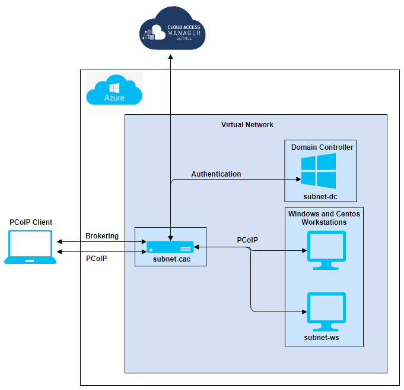

# Single-Connector Deployment

## Table of Contents
1. [Requirements](#requirements)
2. [Connect Azure to Cloud Access Manager](#connect-azure-to-cloud-access-manager)
3. [Deploying Azure Storage Account](#deploying-azure-storage-account)
4. [Deploying the Single-Connector via Terraform](#deploying-the-single-connector-via-terraform)
5. [Adding Workstations in Cloud Access Manager](#adding-workstations-in-cloud-access-manager)
6. [Starting a PCoIP Session](#starting-a-pcoip-session)
7. [Changing the deployment](#changing-the-deployment)
8. [Deleting the deployment](#deleting-the-deployment)
9. [Single-Connector Architecture](#single-connector-architecture)

This document is a guide on how to deploy a single-connector deployment on Azure from **Azure Cloud Shell** (ACS).

### Requirements
- Access to a subscription on Azure.
- a PCoIP Registration Code. Contact sales [here](https://www.teradici.com/compare-plans) to purchase a subscription.
- a Cloud Access Manager Deployment Service Account. CAM can be accessed [here](https://cam.teradici.com/)
- [Terraform v0.13.5](https://www.terraform.io/downloads.html)
- [Azure Cloud Shell](https://shell.azure.com) access.
- [PCoIP Client](https://docs.teradici.com/find/product/software-and-mobile-clients)

### Connect Azure to Cloud Access Manager
To interact directly with remote workstations, an Azure Account must be connected to the Cloud Access Manager.
1. Login to the [Azure portal](http://portal.azure.com/)
2. Click Azure Active Directory in the left sidebar and click app registrations inside the opened blade.
4. Create a new application for the deployment by clicking 'New registration'. If you already have an application under 'Owned applications', this information can be reused.
5. Copy the following information from the application overview: 
    - Client ID
    - Tenant ID
    - Object ID
6. Under the same app, click Certificates & secrets.
7. Create a new Client Secret or use an existing secret. This value will only be shown once, make sure to save it.
6. Go to Subscriptions by searching 'subscription' into the search bar and click on the subscription of your choice.
7. Copy the Subscription ID and click on Access control (IAM) on the blade. 
8. Click 'Add', select 'Add role assignment' and follow these steps to add roles:
    1. Under 'Role' select 'Reader'.
    2. Leave 'Assign access to' as default.
    3. Under 'Select' search for the application name from step 4 and click save.
    4. Repeat these steps for the role 'Virtual Machine Contributor'.
9. Login to Cloud Access Manager Admin Console [here](https://cam.teradici.com) using a Microsoft business account.
10. Create a new deployment and submit the credentials into the Azure form.
11. Click 'Connectors' on the side bar and create a new connector. 
12. Input a connector name to generate a token which will be used in terraform.tfvars.

### Deploying Azure Storage Account
Before deploying the single-connector deployment, an Azure Storage Account must be created that will store scripts to be executed on the VMs. 
1. Change into ```~/terraform-deployments/tools/deploy-script-storage-account/```
2. Run ```terraform init``` and then ```terraform apply``` to start the deployment of the Azure Storage Account. 
3. A URI will be generated that will be used as a value under the _artifactsLocation variable in terraform.tfvars.

### Deploying the Single-Connector via Terraform
terraform.tfvars is the file in which a user specifies variables for a deployment. The ```terraform.tfvars.sample``` sample file shows the required variables that a user must provide, along with other commonly used but optional variables. Uncommented lines show required variables, while commented lines show optional variables with their default or sample values. A complete list of available variables are described in the variable definition files ```default-vars.tf``` and ```required-vars.tf``` of the deployment.

After saving terraform.tfvars with inputs:
1. Change directory into ```~/terraform-deployments/deployments/single-connector```.
2. Save ```terraform.tfvars.sample``` as ```terraform.tfvars```, and fill out the required variables.
    - Make sure the locations of the connectors and work stations are identical.
3. Run ```terraform init``` to initialize modules inside the deployment.
4. Run ```terraform apply``` to display resources that will be created by Terraform.
5. Answer ```yes``` to start provisioning the single-connector infrastructure. 

A typical deployment should take around 40 minutes. When finished, the scripts will display VM information such as IP addresses. At the end of the deployment, the resources may still take a few minutes to start up completely. Connectors should register themselves with the CAM service and show up in the CAM Admin Console.

### Adding Workstations in Cloud Access Manager
1. Go to the CAM Admin Console and ensure you have your deployment selected. 
2. Click Workstations on the right sidebar, click the blue '+' and select "Add existing remote workstation". 
3. Select 'Private Cloud' or 'Azure' with the name of your resource group declared in terraform.tfvars.
4. Under 'Remote Workstations' select the Windows and CentOS host machines.
5. Under 'User Entitlements for Workstations' add the Active Directory username declared in terraform.tfvars.

Note that it may take a 5-10 minutes for the workstation to show up in the 'Select Remote Workstations' drop-down box.

### Starting a PCoIP Session
Once the workstations have been added to be managed by CAM and assigned to Active Directory users, a user can connect through the PCoIP client using the public IP of the Cloud Access Connector.

1. Open the Teradici PCoIP Client and click on 'NEW CONNECTION'.
2. Enter the public IP address of the Cloud Access Connector (CAC) virtual machine and enter a name for this connection. 
3. Input the credentials from the account that was assigned under 'User Entitlements for Workstations' in CAM.
4. Click on a machine to start a PCoIP session.
5. To connect to different workstations repeat steps 1-4.

### Changing the deployment
Terraform is a declarative language to describe the desired state of resources. A user can modify terraform.tfvars and run ```terraform apply``` again. Terraform will try to only apply the changes needed to acheive the new state.

Note that changes involving creating or recreating Cloud Access Connectors requires a new connector token from the CAM Admin Console. Create a new connector to obtain a new token.

### Deleting the deployment
Run ```terraform destroy``` to remove all resources created by Terraform. Another alternative is to delete the resource group from Resource groups page in Azure. 

### Single-Connector Architecture

The Single-Connector deployment creates a Virtual Network with 3 subnets in the same region, provided that the workstations defined in terraform.tfvars do not have distinct locations. The subnets created are:
- ```subnet-dc```: for the Domain Controller
- ```subnet-cac```: for the Connector
- ```subnet-ws```: for the workstations

Network Security Rules are created to allow wide-open access within the Virtual Network, and selected ports are open to the public for operation and for debug purposes.

A Domain Controller is created with Active Directory, DNS and LDAP-S configured. Domain Users are also created if a ```domain_users_list``` CSV file is specified. The Domain Controller is given a static IP (configurable).

A Cloud Access Connector is created and registers itself with the CAM service with the given Token and PCoIP Registration code.

Multiple domain-joined workstations and Cloud Access Connectors can be optionally created, specified by the following respective parameters:
- ```workstations```: List of objects, where each object defines a workstation
- ```cac_configuration```: List of objects, where each object defined a connector

The ```workstation_os``` property in the ```workstations``` parameter can be used to define the respective workstation's operating system (use 'linux' or 'windows'). 

Note: Please make sure that the ```location``` property in the ```workstations``` parameter is in sync with the ```location``` property defined in the ```cac_configuration``` parameter. 

Each workstation can be configured with a graphics agent by using the ```isGFXHost``` property of the ```workstations``` parameter.

These workstations are automatically domain-joined and have the PCoIP Agent installed.

The following diagram shows a single-connector deployment instance with multiple workstations and a single Cloud Access Connector deployed in the same region specified by the user. 


